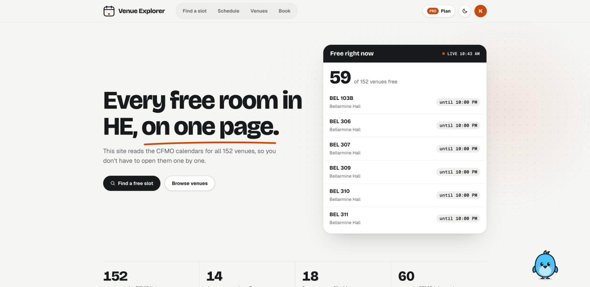
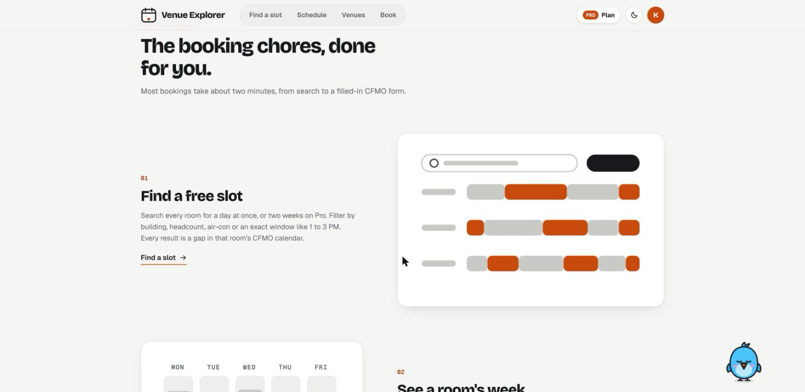
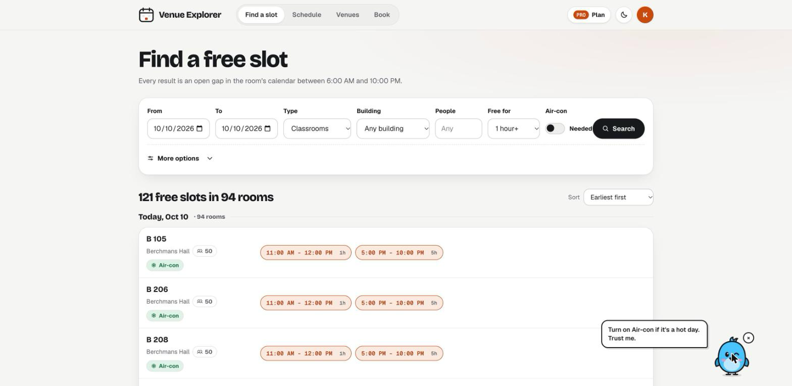
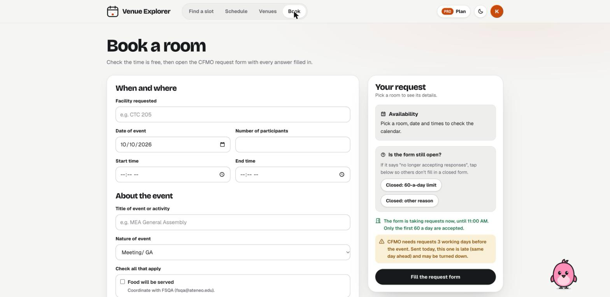
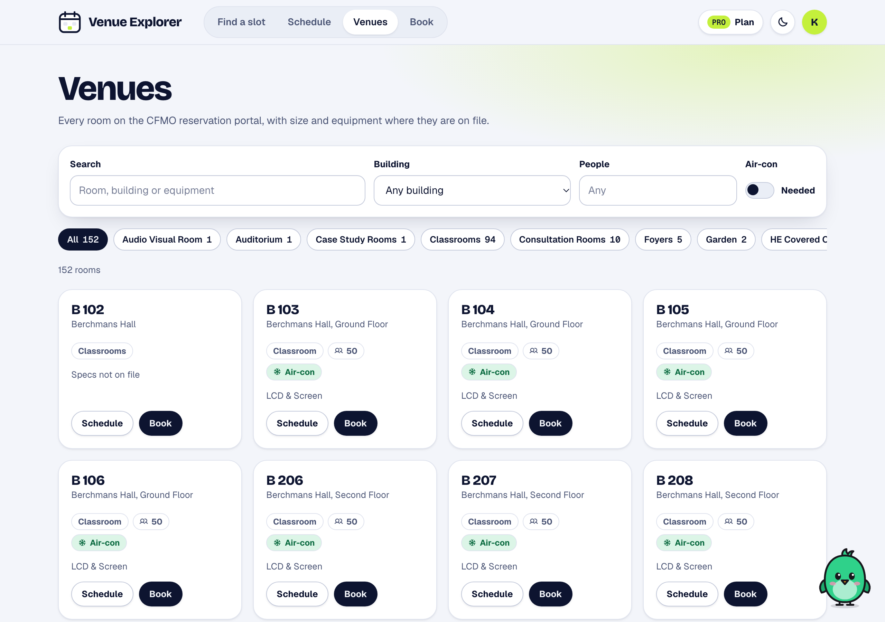
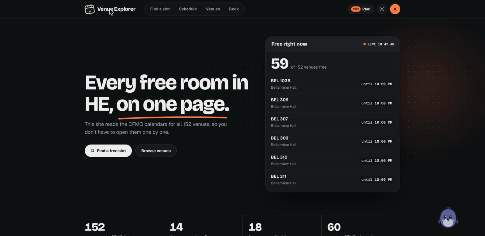

<div align="center">

# HE Venue Explorer

**Every free room in Ateneo HE, on one page.**

A Google Apps Script web app that reads the CFMO venue calendars for all 152 HE venues, finds the free slots, and fills in the CFMO reservation form for you.

[**Open the portal →**](https://script.google.com/a/macros/student.ateneo.edu/s/AKfycbw_zN1l9PCFGz35TdrD-ClBp77L8Csi8Sd7rPUljYO7Z3L7uvLhKkhGQb2rvokNbfYB/exec)

<sub>Needs an @student.ateneo.edu or @ateneo.edu Google account.</sub>

<br>





</div>

---

## What it does

Booking a room used to mean opening CFMO calendars one at a time, writing down the gaps, then typing the same org details into the request form again. Venue Explorer does that in one place.

| | |
|---|---|
| **Find a slot** | Search every room at once for a date range. Filter by type, building, headcount, air-con and equipment, or look for a specific time window, like "free from 1 to 3 PM". |
| **Schedule** | One room's bookings across several days, with the free time between them. Events that run past midnight or last several hours are split cleanly per day. |
| **Venues** | All 152 rooms with capacity, air-con and AV equipment where CFMO has it on file. |
| **Book** | Every question on the CFMO request form, checked against CFMO's rules before you open it, then sent as a prefilled link. Saved org profiles mean you only type your details once. |
| **Saved requests** | Pro users can save a filled form link in their browser, prepare it the day before, and open it the moment the CFMO form starts taking requests. The home page reminds them when one is due today or tomorrow. |
| **Form status** | Warns you when the CFMO form is outside intake hours, has hit its 60-a-day limit, or is closed, so you don't fill it in for nothing. |
| **Report an issue** | Sends a bug report or idea to the maintainer by email and logs it in the backend sheet. |

<table>
<tr>
<td width="50%"></td>
<td width="50%"></td>
</tr>
<tr>
<td width="50%"></td>
<td width="50%"></td>
</tr>
</table>

It works on phones, has a dark mode, and comes with Agi, a small pet bird that gives tips for whatever page you're on, chats, naps, and does stunts on its own: hops, flights, falls, backflips, moonwalks and more.


## Plans

Everyone with a school account gets Free. Pro is unlocked with a one-person access key that the maintainer approves.

| | Free | Pro |
|---|---|---|
| Days per search | 1 | 14 |
| Slot searches per day | 10 | 300 |
| Schedules per day | 15 | 300 |
| Prefilled CFMO links | – | 150 / day |
| Saved org profiles | – | ✓ |

Students request a key from the **Plan** page. The request lands in the backend sheet and the owner gets an email. Once it's marked *Approve*, **Send keys to approved requests** emails each student their key. Keys are stored hashed and are tied to the account that redeems them.

## Emails

Every email is table-based HTML with inline styles, so it looks the same in Gmail, Apple Mail and Outlook. Gmail strips SVG and embedded images, so the logo is drawn with table cells. Each email also has a plain-text version.

Five emails in total: Pro request (to the owner), request received (to the student), Pro key, issue report, and the reporter's copy.

## How it's built

There's no server or build step. Everything runs inside a container-bound Apps Script project attached to the *CLDN HE Venue Explorer* Google Sheet.

```
apps-script/
├── Code.gs            Sheet menu, calendar reads, free-slot maths, CFMO form schema and checks
├── Portal.gs          Web app: doGet / doPost, the api* functions the page calls
├── Access.gs          Plans, daily limits, access keys, key requests, issue reports
├── Emails.gs          HTML email layout and the five emails
├── Setup.gs           buildWorkbook(): builds and styles every sheet tab
├── PortalPage.html    Page shell
├── PortalApp.html     Client app (routing, pages, loaders)
├── PortalStyles.html  Theme, tokens, dark mode, responsive rules
├── PortalMascot.html  The pet
├── RequestShared.html Form rules shared by the portal and the sheet dialog
├── RequestDialog.html "New venue request" dialog inside the sheet
└── appsscript.json    Manifest (V8, Asia/Manila, Calendar advanced service)
```

A few details that took a while to get right:

- **Several Google accounts signed in.** `google.script.run` can fail when a browser has more than one account signed in. Form submissions use real page POSTs with a short-lived signed token, and lookups fall back to a full-page reload when the live call fails.
- **Calendar edge cases.** Events are clipped per day, deduplicated, and dropped if they're cancelled, zero-length or marked free, so a three-hour event shows once rather than three times.
- **Prefilled Google Forms.** Choices with an "Other" option use `__other_option__`, dates are split into year, month and day fields, and the Conforme question is left for the student to answer. If the form shows old answers, the student has a saved draft. Clearing it fixes that.
- **Caching.** Calendar reads are cached per venue and day so a 14-day search across 152 rooms stays under Apps Script's time limits.

## Setting it up yourself

1. Make a Google Sheet, then open **Extensions › Apps Script**.
2. Add each file in `apps-script/` with the same name. Use a Script file for `.gs` and an HTML file for `.html`. Paste `appsscript.json` into the manifest (turn on *Show "appsscript.json"* in Project Settings).
3. Run `buildWorkbook` once from the editor and accept the permissions. This creates every tab.
4. Back in the sheet, use **HE Venue Explorer › Refresh venue registry** to pull the venue calendars.
5. For the portal and Pro keys, run **HE Venue Explorer › Access keys (owner) › Set up access backend**.
6. **Deploy › New deployment › Web app**. Set *Execute as* to **Me** and *Who has access* to your domain.

Owner tools live under **HE Venue Explorer › Access keys (owner)**: generate keys, send keys to approved requests, revoke access, and **Email me sample emails** to preview every email design.

## Credits

Made by **Keene Brigado**. Special thanks to **David Yu**.

Venue data comes from the public CFMO venue calendars. This is a student-made tool and isn't affiliated with or endorsed by CFMO or the Ateneo de Manila University.
